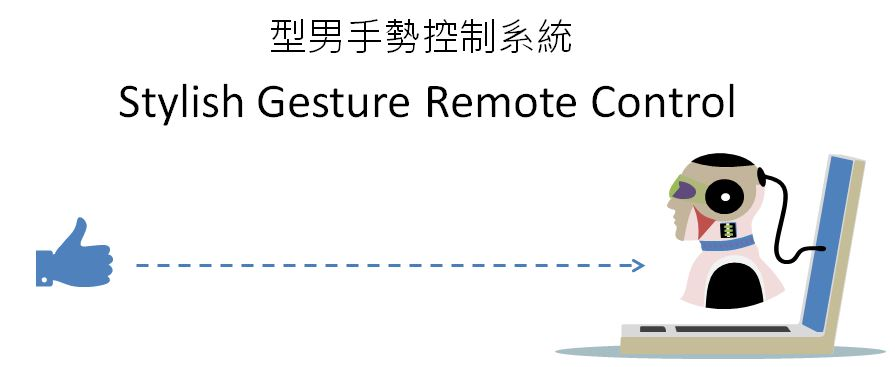
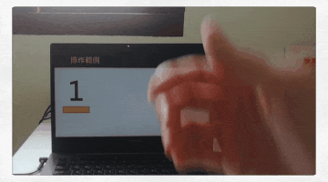
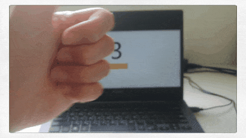
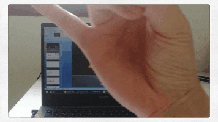
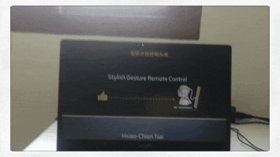
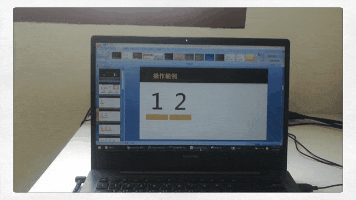
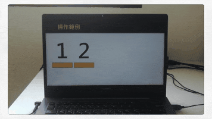
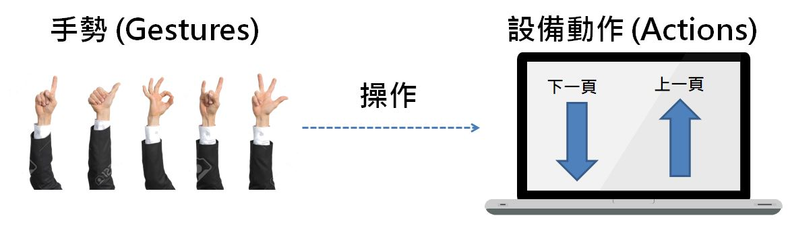
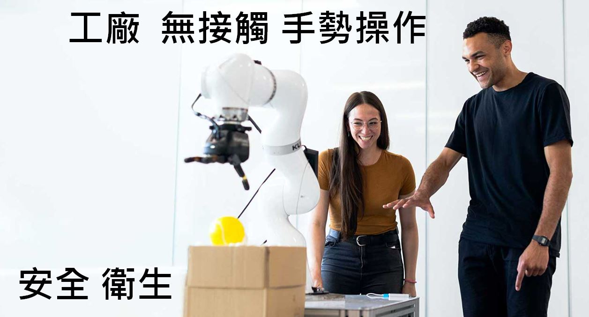
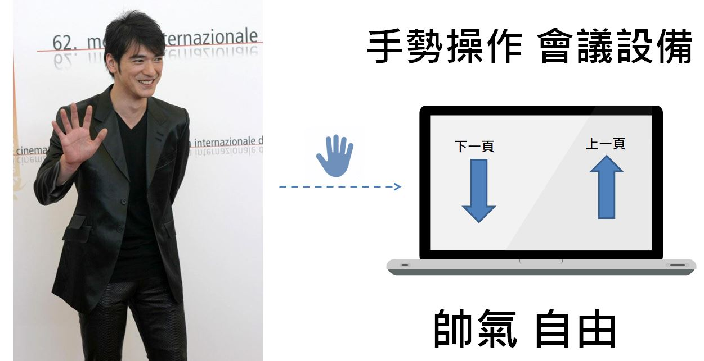

# 型男手勢控制系統 
* 讓你用 帥氣的手勢 控制設備
* 讓你用 型男的手勢 操作簡報

## 1. 安裝說明
### 使用 pip 安裝以下 Library
* pip install mediapipe==0.8.3
* pip install opencv-python==4.5.2.52
* pip install keyboard==0.13.5

若安裝opencv-python 遇到權限問題，可改用:
* pip install --user opencv-python==4.5.2.52

也可使用 :
* pip install -r requirements.txt

### 2. 手勢操作電腦
1. 運行 guesture_powerpoint_control.py
2. 打開 powpoint 進行手勢操作 
3. 全程使用型男帥氣手勢，完成整個簡報流程 (完全不需要操作鍵盤滑鼠)

### 3. 手勢操作範例

紳士風 (Gentleman Style)
* [右手比讚] --> [AI 按下鍵盤 page down] --> [簡報下一頁]
* 
* [左手比讚] --> [AI 按下鍵盤 page up] --> [簡報上一頁]
* 

搖滾風 (Rock Style)
* [右手Rock] --> [AI 按下鍵盤 shift+F5] --> [播放簡報]
* 
* [左手Rock] --> [AI 按下鍵盤 esc] --> [停止播放簡報]
* 

韓風 (Korean Style)
* [右手比心] --> [AI 按下鍵盤 shift+F5] --> [播放簡報]
* 
* [左手比心] --> [AI 按下鍵盤 esc] --> [停止播放簡報]
* 

* (上次我這樣開會，很多女生都要跟我加Line)
* 

### 4. 系統設定說明 

設定 Hand Gestures 所對應的鍵盤動作：

data/gesture_to_keyboard.txt
可設定 gesture_name, keyboard_key 之間的對應關係

* ["right_thumbs_up"] ---> ["page down"]
* ["left_thumbs_up"] ---> ["page up"]

* ["right_heart"] ---> ["shift+F5"]
* ["left_heart"] ---> ["esc"]

### 5. 原理說明

* 1.擷取視訊中的frame
* 2.分析 frame 出現的手，與關鍵節點 (landmarks)
[landmarks 圖](https://google.github.io/mediapipe/images/mobile/hand_landmarks.png)
* 3.將關鍵節點，放入一個 Queue 內等待分析
* 4.定期分析Queue 內，是否存在某些 Gestures
	* 規則偵測 Gesture pattern
	* 時間序列模型偵測 Gesture

* 5.將 Gesutre 轉換成鍵盤事件執行

### 6. 疑難排解

* 問題1: 運行程式碼出現錯誤訊息

from mediapipe.python._framework_bindings import resource_util ImportError: DLL load failed: 
The specified module could not be found.
https://github.com/google/mediapipe/issues/1839

* 原因: 

沒有安裝 Microsoft Visual C++ Redistributable，無法運行opencv
https://github.com/google/mediapipe/issues/1839

* 解決方法：安裝 Microsoft Visual C++ Redistributable

https://support.microsoft.com/en-us/topic/the-latest-supported-visual-c-downloads-2647da03-1eea-4433-9aff-95f26a218cc0
https://aka.ms/vs/16/release/vc_redist.x64.exe

### 7. 延伸應用

* 智慧製造：

---
* 產品發表會：

---